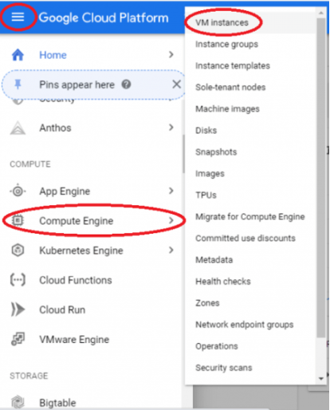
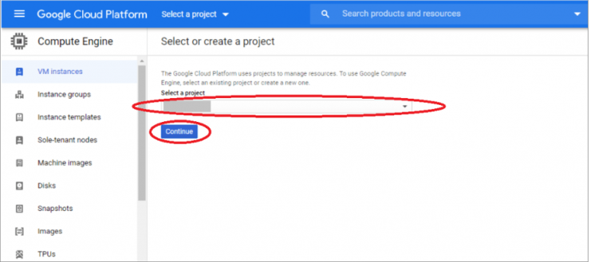
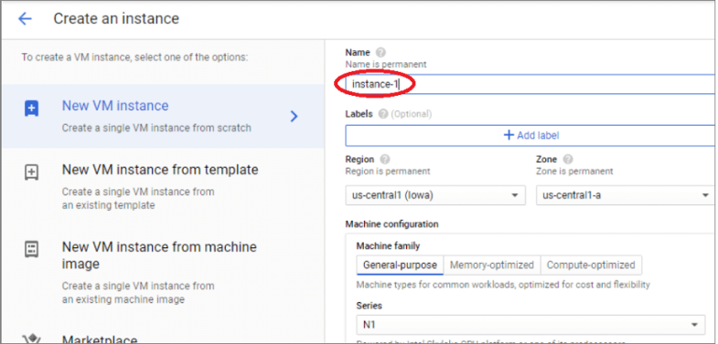

# Create VM on Google Cloud
* [Go to Control Panel](#Go-to-Control-Panel)
* [Setup](#Setup)

Linux-Remote Server are Linux-based virtual machines (VMs) that run on top of virtualized hardware
VMs are managed using a terminal and SSH. You’ll need to have an SSH client and, optionally, an SSH key pair. Clients generally authenticate either using passwords (which are less secure and not recommended) or SSH keys (which are very secure and strongly recommended).
We recommend you use SSH keys to connect to your VM.

## Go to Control Panel
Create DigitalOcean account from https://console.cloud.google.com/start

Log in to google clous console  https://console.cloud.google.com/

Click on ‘Navigation Menu’ and select ‘Compute Engine’ -> ‘VM instances’:

If you are creating the instance for the first time, you will be prompted to create a project. Each instance belongs to a Google Cloud Project, which can have one or more instances.
Otherwise, select an existing project and continue.

## Create an instance
Click on the ‘Create’ button of the ‘Compute Engine – VM Instances’ pop-up window, and the ‘Create an instance’ screen will appear.

Name your instance and choose which options suit you best.

Click Create and now you have a new instance in your google cloud.
